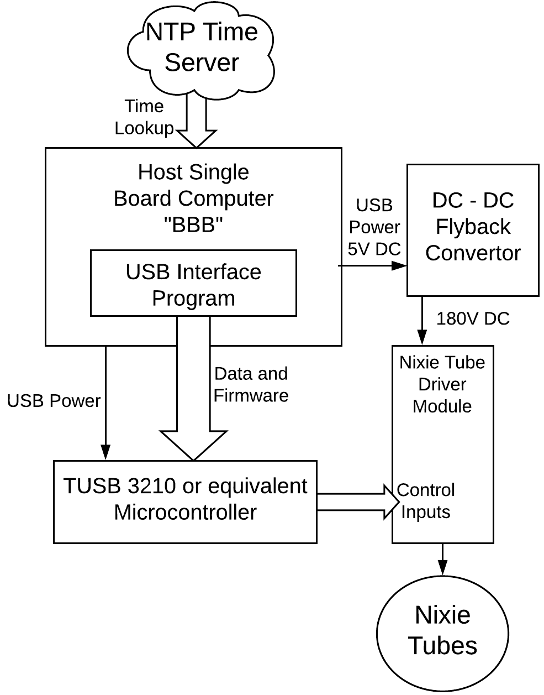
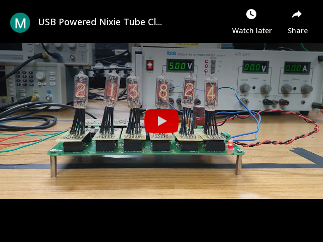

# Program a TUSB3210 Microcontroller
***
<p align="center">
  
  <br>
<b>Block Diagram of our project</b>
</p>

****

The now discontinued [TUSB3210 microcontroller](media/tusb3210.pdf) by Texas Instruments was used in our project on a USB powered and controlled Nixie Tube clock display.

Details of our project can be found in a three part series-

Part 1: [Nixie Tube Characterization](https://ishank-juneja.github.io/blog/nixieClock)<br>
Part 2: [Power Supply Design](https://ishank-juneja.github.io/blog/nixieClockPower)<br>
Part 3: [Clock Controller Design](https://ishank-juneja.github.io/blog/nixieClockController)

***
### **About the TUSB3210**

The TUSB3210 is a RAM only Micro-Controller which *used* to be a popular Texas Instruments controller for USB peripherals such as Keyboards and Mice until just a few years ago (discontinued ~ 2010). 

The firmware for the TUSB3210 controller is stored in the RAM only. This is not very common since usually micro-controllers have dedicated code ROM and the onchip RAM is entirely for the programmer to use. This is the case, for example with the classic 8051/52 micro-controllers used in university labs.  

The advantage of a RAM only micro-controller lies in reducing cost through two means.
1. The absence of expensive *flash ROM* makes each chip cheaper, so if it is possible for the hardware to be reprogrammed via USB, every time it is connected to the host, RAM only MCUs are a better solution. Mice, Keyboards and WiFi modules are examples of such hardware
2. Hardware that does not hold on to any code, and is necessarily reprogrammed every time it is plugged in, makes firmware updates seamless for users.    
3. In case of reprogrammable hardware (development boards, TI launchpad equivalents or even our own projects) a RAM only MCU reduces the requirements for a dedicated programmer that can flash the onboard EEPROM of the MCU. In other boards separate Hardware in the form of a FT232 or equivalent IC is needed to talk to the onchip ROM. A RAM only controller can thereby save on part costs and circuit board complexity

Reason 3 was the primary reason for our choice of a RAM only micro-controller. Further we went for the TUSB3210 since it was available with our advisor. 

### **Installation**
Requirements
- Recent linux distribution. Tested on `Ubuntu 16.04 LTS` 
- Small Device C compiler (SDCC) version 2.3.0
    - Embedded C programmers might be familiar with the C51 compiler that comes with the Keil IDE. SDCC is an equivalent lightweight and linux friendly C compiler.
    - SDCC 2.3.0 can be installed by extracting `nixie_usb_original/sdcc-2.3.0-i386-unknown-linux2.2.tar.gz` and following the instructions in `INSTALL.txt`.
- Hex to binary convertor
    - By default SDCC compiles an embedded C file to a `.hex` file. This is quite typical of embedded C compilers. However, the bootloader requires a binary `.bin` file instead, so the `hex2bin` program is required.
    - It can be installed by extracting `Hex2bin-2.5.tar.bz2` using `tar jxvf Hex2bin-2.5.tar.bz2`
    - The directory contains the executable `hex2bin`, this binary can either be placed in `/usr/local/bin` or the path to `hex2bin` can be added to the local `PATH` variable using `PATH=$PATH:~/path/to/hex2bin`. Either method will make `hex2bin` accessible from elsewhere, which is needed next.   

### **Usage and Functionality**
The bootloader and template host program were put together by our project advisor [Mukul Chandorkar](https://www.ee.iitb.ac.in/~mukul/). The original versions are present in `nixie_usb_original` which is shown below 
```
.
├── tusb_nixie_fw
│   ├── bootloader
│   │   ├── Makefile
│   │   ├── sboot
│   │   └── sboot.c
│   ├── commands.h
│   ├── descrip.h
│   ├── Makefile
│   ├── sboot
│   ├── tfirm.bin
│   ├── tfirm.c
│   ├── tusb2136.h
│   ├── types.h
│   ├── usbdefs.h
│   ├── usbiofun.c
│   └── usbiofun.h
└── usbc
    ├── commands.h
    ├── Makefile
    ├── usbc
    └── usbc.c

```
The folders of interest here are `tusb_nixie_fw` which contains the firmware and the bootloader and `usbc` which deals with the host side program.

As illustrated in the above block diagram, the control module consists of a host computer talking to the TUSB3210 micro-controller via USB. The control flow is specified below. Commands dealing with USB IO require root permissions using `sudo`.  
1. The firmware consists of the files `tfirm.c` and `usbiofun.c`.
    - `usbiofun.c` consists of functions with some specially named variables which can be called by the host side program to interrupt the controllers execution to change its state.
    - `tfirm.c` contains the `main` thread being run on the controller. The code contains an infinite `while` loop as the segment repeatedly executed by the controller.
2. Once `usbiofun.c` is ready, we can run `make` in `tusb_nixie_fw` to generate the firmware`tfirm.bin`.
3. We must also compile the host side program `usbc.c` to the binary `usbc` by running `make` in thr `usbc` directory.
4. Next navigate to `tusb_nixie_fw/bootloader` and run `./sboot ../tfirm.bin` to use the bootloader to upload the firmware.
5. Once the firmware has been uploaded successfully (we noticed that there were occasional upload fails for reasons that could not be identified) the host side program can be ran by navigating to `usbc` and running `./usbc`.
6. The host program triggers suitable interrupt routines on the MCU to toggle around its GPIO control signals as specified in `usbiofun.c`.
7. The host side program `usbc.c` is written in a way such that it prints the response received from the controller after sending every command. We observed that occasionally the connection between the TUSB3210 and the host would break down midway during communication. We suspect this was a result of poor connection between the USB cable and the USB type B connector placed on our board. Frequent plug ins and plug outs caused significant wear on the cable teeth.    

### **Controlling a clock display**
The main contributions of our project are the Isolated Power Supply and The controller board designed in a manner as to maintain complete isolation between high voltage and low voltage sides. You can find the details of those [here](https://ishank-juneja.github.io/blog/).

On the software side, there are three files of interest 
1. `tusb_nixie_fw/usbiofun.c`: The file contains the interrupt routines implemented by the controller whenever a new packet of information arrives at its USB interface. In this case this packet is the current time information being relayed by the host.
2. `tusb_nixie_fw/tfirm.c`: Contains the code that uses the information relayed by the host to display the time on the Nixie Tube display using 10 control signals - One for each of the 6 tubes, a single tube being active at a time, and 4 to interact with IC 74141 for digit (0-9) selection using the Binary Coded Decimal (BCD) format.
3. `usbc/usbc.c`: Contains the host side program that every 1s, queries system time and send this information to the controller in a single packet.

The procedure to install and run remains the same as the one described in the previous section with the `nixie_usb_original` directory being replaced by the outermost directory of this repository.

Linked below is a video of our project in action with a glimpse of the communication setup between the host and the controller towards the end of the video in the lower right corner of the frame.

<p align="center">
  <a href="http://youtu.be/MN-FbMPmbiw">
         
      </a>
</p>
